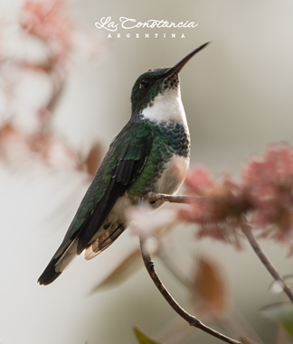
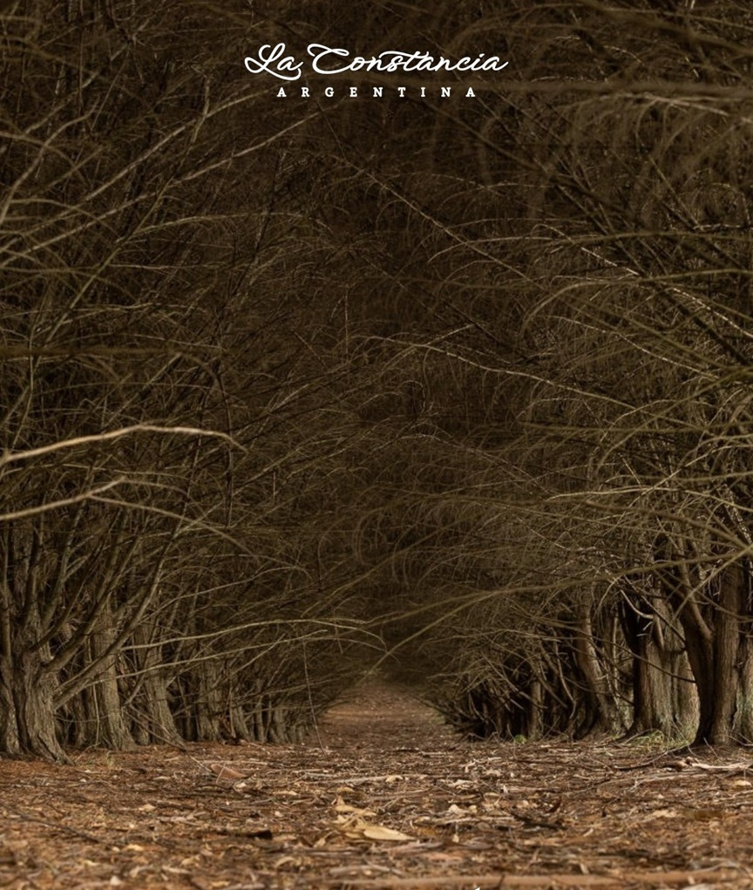
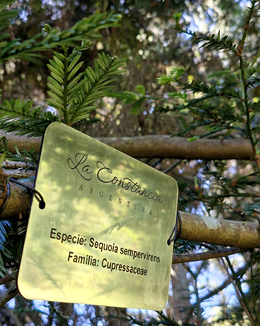
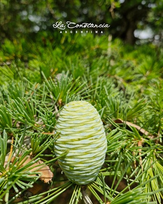
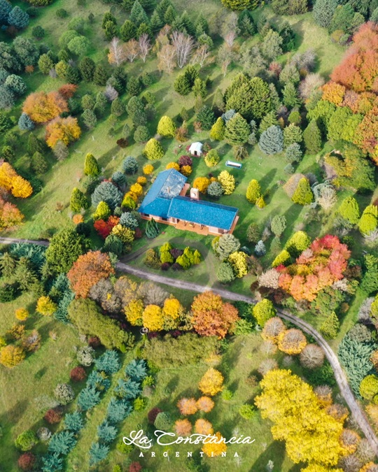

::: {.hero-banner}
::: {.hero-overlay}

# Visitas Botánicas

### Arboretum de Estancia La Constancia

<!-- 
 -->
<!-- Educación Ambiental · Biodiversidad · Aprendizaje en Terreno -->
<!-- 
 -->

:::
:::

::: {.lead-text}
::: {.justificado}
En el marco de la [XXI Reunión Argentina de Ornitología (RAO)](https://rao.avesargentinas.org.ar/), el Arboretum de Estancia La Constancia abre sus puertas a instituciones educativas, docentes y grupos interesados en descubrir la riqueza natural del lugar a través de la observación directa del paisaje.

Las visitas se realizarán el **viernes 7 y sábado 8 de agosto de 2026 a las 10:00 hs** e incluirán recorridos guiados que invitan a conocer la diversidad vegetal del arboretum y, al mismo tiempo, a identificar y disfrutar del avistaje de las numerosas especies de aves que encuentran refugio y alimento en este entorno.

::: 
:::

## El Arboretum 
::: {.justificado}
La [Constancia de Biocca](https://estancialaconstanciamdq.com/) es un arboretum de 33 hectáreas ubicado en Mar del Plata, con más de 300 especies de árboles y 40 especies de aves registradas. Su diversidad vegetal crea un hábitat ideal para el avistaje de aves y la educación ambiental, ofreciendo una experiencia única de contacto con la naturaleza.

Este arboretum fue fundado por Héctor Biocca, quien, junto a sus hijos, diseñó y plantó cada una de las especies que hoy forman parte de esta colección viva. Su dedicación exclusiva y el cuidado permanente de cada ejemplar garantizaron el exitoso desarrollo y mantenimiento del arbolado. Hoy, cuarenta y cinco años después, La Constancia de Biocca exhibe parques de gran riqueza paisajística y biodiversidad, con la aspiración de constituirse en un legado para las futuras generaciones.
:::
<!-- ## Experiencias Botánicas -->

<!-- ::: {.panel-tabset} -->

<!-- ### 🌳 Recorrido Botánico Guiado -->

<!-- - Reconocimiento de árboles, arbustos, herbáceas y trepadoras. -->
<!-- - Observación de especies nativas y exóticas y sus principales características. -->
<!-- - Introducción a la identificación botánica mediante hojas, flores, frutos y cortezas. -->
<!-- - Interpretación de los ambientes y ecosistemas presentes en el arboretum. -->
<!-- - Descubrimiento de las relaciones entre plantas, animales y paisaje. -->

<!-- ### 🌿 Beneficios -->
<!-- - Aprendizaje práctico de contenidos de botánica, ecología y ciencias naturales. -->
<!-- - Desarrollo de habilidades de observación y pensamiento científico. -->
<!-- - Fomento de la curiosidad y del vínculo con la naturaleza. -->
<!-- - Actividades adaptadas a los objetivos pedagógicos de cada institución. -->

<!-- ### 🥾 Exploración en Senderos -->

<!-- - Acompañamiento de profesionales especializados. -->
<!-- - Actividades participativas de reconocimiento de especies y diversidad vegetal. -->
<!-- - Observación de procesos naturales como la floración, fructificación y dispersión de semillas. -->
<!-- - Espacios para la reflexión sobre conservación, restauración ecológica y sostenibilidad. -->

<!-- ::: -->

---

## Galería

::: {.image-grid-2x3}

:::

## Contenidos de las Visitas

<!-- ### 🌳 Algunos de los temas que abordamos -->

<!-- - **Historia del Arboretum:** transformación de un antiguo potrero en un espacio de conservación y educación ambiental. -->
<!-- - **Diversidad vegetal:** reconocimiento de especies nativas y exóticas y su importancia ecológica. -->
<!-- - **Botánica aplicada:** cómo identificar plantas a partir de sus estructuras y características morfológicas. -->
<!-- - **Ecología de los ecosistemas:** relaciones entre flora, fauna, suelo y clima. -->
<!-- - **Conservación y restauración:** el papel de los arboretos en la protección de la biodiversidad y la recuperación de ambientes degradados. -->
<!-- - **Exploración sensorial:** propuestas para descubrir los colores, aromas, texturas y formas del jardín. -->

- Caminata guiada de 1 hora y media junto a biólogos/as y guías naturalistas especializados.

- Recorrido por distintos ambientes del Jardín, con especial énfasis en los hábitats de aves y su relación con la vegetación del jardín.

- Conocerán la transformación de un antiguo potrero en un jardín de 33 hectáreas con más de 30.000 plantas, hoy convertido en un espacio clave para la vida silvestre.

- Luego de la caminata, habrá 1 hora adicional para descanso, observación libre o intercambio entre participantes.

- Encuentro con personas apasionadas por las aves, la conservación y la naturaleza.

## Información General

### 🌳 Día y Horario    

- Viernes 7 de agosto de 2026 a las 10 am.

- Sábado 8 de agosto de 2026 a las 10 am.

### 🌳 Cómo inscribirse en la visita

- **Expresa tu interés:** Haz clic en el botón "Quiero Sumarme a la Visita", donde podrás acceder a los medios de pago.

- **Confirmación:** Una vez realizado el pago, nos pondremos en contacto contigo para confirmar tu lugar.

::: {.cta-container}
<a href="https://docs.google.com/forms/d/e/1FAIpQLSfPfe_--UakdPwsknpYmNka_ithUyZeqDQtb-CHc9zEp807jQ/viewform" target="_blank" class="cta-button">
Quiero Sumarme a la Visita 
</a>
:::

### 🌳 Precios por Persona

- Hasta el 30 de Junio 2026 (inclusive) **60% de descuento**: Precio Final: $10,000 

- Hasta el 19 de Julio 2026 (inclusive) **40% de descuento**: Precio Final: $15,000

- Hasta el 2 de Agosto 2026 (inclusive) **20% de descuento**: Precio Final: $20,000

- Desde el 3 de Agosto 2026: Precio Final: $25,000

Niños abonan ingreso a partir de los 12 años. 

### 🌳 Cómo llegar al Arboretum

El Arboretum de Estancia La Constancia se encuentra en el sur de la ciudad de Mar del Plata, en un entorno rural de fácil acceso desde los principales puntos de la ciudad.

🚗 En auto

Desde el centro de Mar del Plata, se accede por Camino 515. El recorrido dura aproximadamente 20–30 minutos, dependiendo del tránsito. Se recomienda utilizar aplicaciones de navegación como Google Maps ingresando “[La Constancia de Biocca](https://maps.app.goo.gl/jQaTGHeaecL4icSg9)” como destino.

🚌 Transporte público

Si bien no exisiten líneas de colectivos que conecten el centro de Mar del Plata con el arboretum, servicios de traslado, como por ejemplo Uber,  llegan sin inconvenientes.

## Contacto y Ubicación

**Correo:** laconstanciaargentina@gmail.com  
**Ubicación:** Arboretum de Estancia La Constancia, Camino 515, Mar del Plata, Argentina

<a href="https://maps.app.goo.gl/jQaTGHeaecL4icSg9"
target="_blank"
class="program-button">
📍 Abrir en Google Maps
</a>

 

::: {.footer-logo}
{.arboretum-footer-logo}
:::